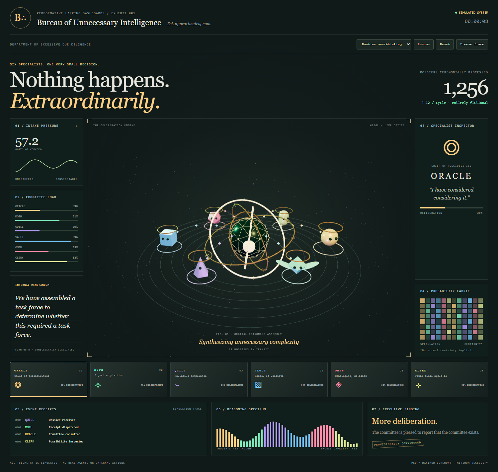

# Performative Larping Dashboards

**Your background job deserves a particle accelerator.**

An open-source Agent Skill for making wildly overproduced dashboards: orbital
agent networks, impossible machinery, tiny operatives with personalities,
volumetric-looking telemetry, ceremonial approval gates, and enough coordinated
instrumentation to imply you are steering a civilization.

The repo layout is boring on purpose. The dashboards absolutely are not.



## Use the skill

Copy `skills/performative-larping-dashboards/` into your agent's skill directory.
For example, `.agents/skills/` for a project that supports that convention, or
`~/.claude/skills/` for Claude Code. Keep the whole folder: the references are part
of the skill. Other agents can read its `SKILL.md` directly.

Then ask:

> Use performative-larping-dashboards to build an agent control room for my research
> pipeline. Full spectacle. React, a sculptural 3D hero, connected agent animations,
> and a portrait composition for social. Label the demo data.

This follows the [Agent Skills format](https://agentskills.io/specification).
It is a skill, not an MCP server. No API keys or paid services are required for the
included example. It does not install tools or publish anything merely by loading.

## The production handbook

- [Skill entrypoint](skills/performative-larping-dashboards/SKILL.md)
- [Maintained toolkit](skills/performative-larping-dashboards/references/toolkit.md)
- [Art direction and spectacle recipes](skills/performative-larping-dashboards/references/art-direction.md)
- [Connected motion and simulation](skills/performative-larping-dashboards/references/choreography.md)
- [React](skills/performative-larping-dashboards/references/react.md)
- [HTML / vanilla web](skills/performative-larping-dashboards/references/html.md)
- [Native and desktop](skills/performative-larping-dashboards/references/native.md)
- [Blender, video, and MCP integration](skills/performative-larping-dashboards/references/production.md)
- [Visual acceptance rubric](skills/performative-larping-dashboards/references/quality.md)

## Run the reference exhibit

```sh
cd examples/bureau
npm ci
npm run dev
```

Open the localhost address printed by Vite. `npm run build` creates a static bundle.
The **Bureau of Unnecessary Intelligence** is a Three.js exhibit with a mechanical
orbital core, six procedural 3D agents, traveling packets, derived telemetry,
scenario changes, pause, reduced-motion support, and an SVG fallback without WebGL.
All data is explicitly simulated. This is theatrical software, not evidence of
agent intelligence or financial returns.

For a repeatable frame use `?t=8`. The simulation and all visuals use that frozen
time. Without the parameter the exhibit runs continuously. The portrait layout is
composed separately instead of shrinking the desktop screenshot.

```sh
npm run verify
```

Verification starts a temporary local server, checks playback and controls at desktop
and portrait sizes, exercises reduced motion and the graphics fallback, and saves
screenshots under `test-results/`. First run: `npx playwright install chromium`.
The verification browser dependency is development-only.

## Why Blender and Remotion are optional

Three.js can construct impressive procedural models directly. Blender is the
recommended upgrade when a scene needs bespoke sculpting, rigging, or baked assets.
Remotion is the recommended video route when the deliverable needs exact frames,
edited sequences, audio, and MP4 output. Neither is required to run a dashboard.

An MCP host can connect to separate tool servers. A server can also implement an
MCP client to call another server, but that is an explicit integration, not a magic
reference in a Markdown file. This skill lets the host coordinate tools and documents
their artifact handoffs. See the production handbook for that boundary.

## Contribute

See [CONTRIBUTING.md](CONTRIBUTING.md). Tool recommendations have review dates and
evidence labels. The example pins its actual dependencies in a lockfile. Platform
recipes marked untested must not be presented as validated integrations.

MIT. Make something irresponsibly elaborate and responsibly labeled.
