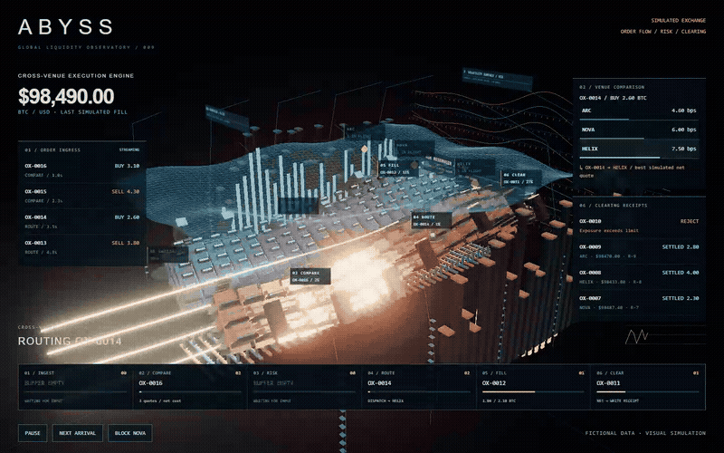
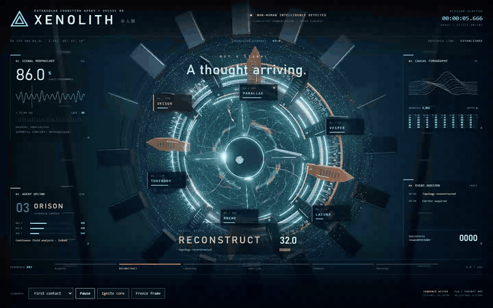
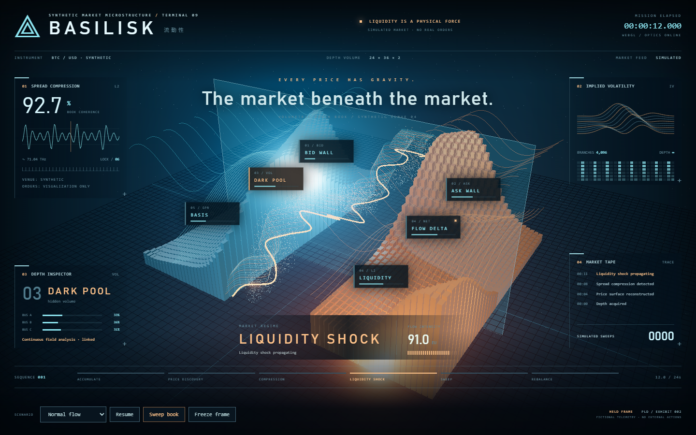

# Performative Larping Dashboards

**Make a screen that looks expensive enough to require its own power station.**

An open-source Agent Skill for useful, extravagantly visual dashboards of **real
activity**: finance, trading, science, infrastructure and agent systems.

**Exaggerate the visuals. Preserve the facts.** Find high-traffic flows, expose real
transformations, and make them spectacular through geometry, scale, depth and
connected motion. Every operational packet, decision and outcome must correspond
to observed data. No invented activity, fake progress or fabricated useful-looking
pipelines. Agents are optional; usefulness and source fidelity are required.

## Current direction: real work, amplified

Start with a traffic audit and a useful question. Select a rich observed flow,
map its events to dramatic visuals, and retain exact values and provenance for
inspection. Use explicit aggregation, history windows and labeled replay to show
volume. Quiet sources stay quiet; disconnected sources show their actual status.

[Real-work guide](skills/performative-larping-dashboards/references/real-work.md) ·
[Skill entrypoint](skills/performative-larping-dashboards/SKILL.md)

## Legacy synthetic studies

**The examples currently in this repo are synthetic visual studies. None is a
validated real-data dashboard under the current requirement.** They preserve
rendering and interaction techniques, not a template for inventing telemetry.
The real-data source contract and acceptance rules are documented; a compliant
source-connected reference implementation has not yet been built or tested.

ABYSS models fictional orders through risk, routing, fills and settlement. Its
persistent identities improved apparent activity, but simulated continuity does
not satisfy the current real-work requirement.



[Run the synthetic study](examples/abyss) · [Still](docs/abyss-work.png)



*Xenolith: procedural machinery, articulated containment, counter-rotating optics,
GPU fields, projected instruments, and a 24-second performance. The GIF is a
13-second excerpt of browser playback, not a generated mockup.*

[Full-resolution playback excerpt](docs/xenolith.mp4) ·
[Still](docs/xenolith.png) · [Portrait](docs/xenolith-portrait.png)

## Install the skill

Copy the complete `skills/performative-larping-dashboards/` directory into your
agent's skill directory: for example `.agents/skills/` in a compatible project,
`~/.codex/skills/`, or `~/.claude/skills/`. References, assets, and scripts stay
inside the skill. Other agents can read its `SKILL.md` directly.

This follows the [Agent Skills format](https://agentskills.io/specification).
It is a skill, not an MCP server. Loading it does not install tools or publish anything.

Example request:

> Use performative-larping-dashboards to visualize our existing request traces.
> Identify the busiest flows and show real fan-out, queueing, retries and completion
> as an extravagant spatial pipeline. Make bottlenecks and individual traces
> inspectable. Preserve source truth, including quiet and disconnected states.

## What the skill supplies

- A **source-first production workflow**, from silhouette and materials to fine
  geometry, instruments, motion, and rendered critique.
- A **real-work contract**: observed inputs, decisions, handoffs, partial results
  and consequences drive animation, with provenance and explicit aggregation.
- A **maintained recommendation sheet** for HTML, React, native, 3D assets, and film export.
- **Domain-to-spectacle recipes** that avoid turning every subject into agent circles.
- **Rendering techniques** for dense assemblies, GPU fields, optics, and attached labels.
- A **reusable director module** for deterministic time, phase envelopes, and seeking.
- A **full-intensity recipe and optics starter** to prevent sparse, underlit first drafts.
- A **capture script** for desktop/portrait frames and live playback.
- **Visual rejection gates**: a small 3D ornament in a conventional dashboard fails,
  even if its tests pass.

Start with [SKILL.md](skills/performative-larping-dashboards/SKILL.md).
The [toolkit](skills/performative-larping-dashboards/references/toolkit.md) distinguishes
tested combinations from documented recommendations. The
[construction playbook](skills/performative-larping-dashboards/references/construction.md)
and [visual gates](skills/performative-larping-dashboards/references/quality.md) define
the production standard.

## Run the legacy synthetic exhibits

```sh
cd examples/xenolith
npm ci
npm run dev
```

Open the localhost address printed by Vite:

| URL suffix | Exhibit / control |
|---|---|
| `/` | Xenolith — non-human cognition vessel |
| `/?world=market` | Basilisk — simulated liquidity canyon |
| `/?t=12` | Hold an exact moment |
| `/?t=12&hud=0` | Inspect the scene without instruments |
| `/?fallback=1` | Exercise the static graphics fallback |

No API keys, remote assets, or paid services are required. All telemetry is
fictional. Pause, scenario, inspection, climax, and freeze-frame controls work.
Reduced motion holds a developed frame. Portrait uses its own staging and label lanes.



*Basilisk changes the physical metaphor to order-book strata and flowing price
ribbons. It shares the renderer and instrument shell; it is a transfer study,
not an independent agent evaluation.*

`npm run build` produces a static bundle. To verify:

```sh
npx playwright install chromium
npm run verify
```

Checks cover deterministic pixels, controls, portrait fit, reduced motion, context
loss, and a full-cycle recording. Evidence goes to ignored `test-results/`.
See [verification and visual review](docs/validation.md) for actual observations,
renderer/performance, and limitations.

The legacy [independent evaluation record](docs/evaluation/README.md) preserves a failed
finance draft, the skill changes it prompted, the improved result, and a fresh
weather exercise. Runnable source snapshots live under `evals/`. Visual review
and functional checks are reported separately. These tests did not validate real
source integration or compliance with the current real-work requirement.

The earlier [Bureau example](examples/bureau) remains available as a lightweight
prototype. It is **not the current spectacle benchmark**.

## Standard packaging, opinionated craft

```text
skills/performative-larping-dashboards/
  SKILL.md
  agents/openai.yaml
  references/
  assets/director.mjs
  assets/optics.mjs
  scripts/capture.mjs
examples/
  abyss/
  xenolith/
  bureau/
evals/
  abyss/
  vesper/
docs/
LICENSE
CONTRIBUTING.md
```

Three.js / Vite / HTML-SVG is the tested browser route. React Three Fiber, native
stacks, Blender, and Remotion have documented recipes and distinct use cases.
Blender helps with bespoke assets; Remotion helps with edited, exact-frame film
exports. They are optional, not ritual dependencies.

An agent host normally coordinates separate MCP tools. A server can act as an MCP
client, but a Markdown reference does not establish that connection. The
[production guide](skills/performative-larping-dashboards/references/production.md)
defines artifact handoffs and the boundary.

Awe is subjective. This repo supplies a reproducible process and inspectable
examples; it does not claim one prompt guarantees the same artistic result from
every model. [Contributions](CONTRIBUTING.md) should improve actual rendered output.

MIT. Maximum ceremony.
