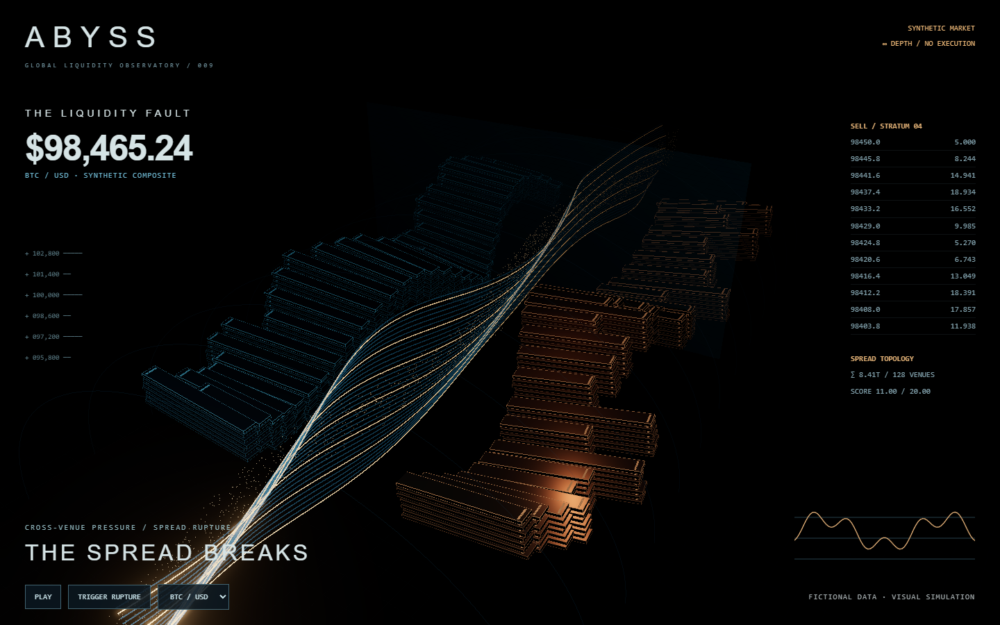
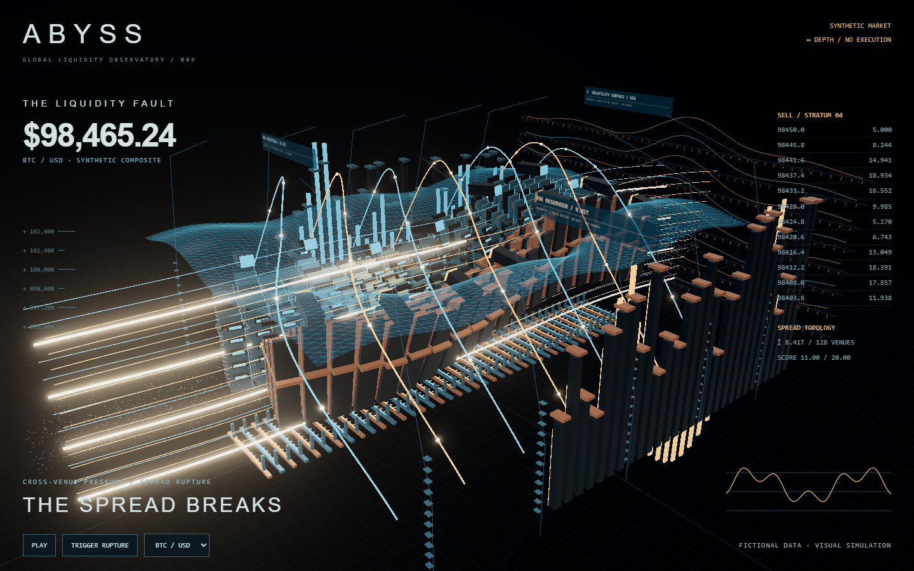
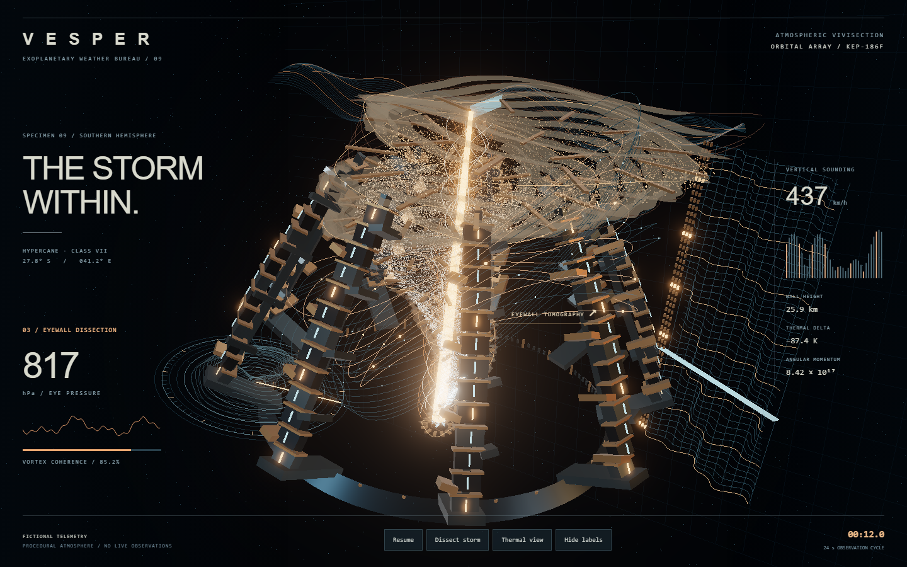

# Independent skill evaluation

These are fresh-context agent exercises, not a statistical benchmark across models.
Evaluators receive a realistic request, the packaged skill, and an isolated output
directory. They are instructed not to inspect repository examples or previews.
Functional correctness and visual ambition are judged separately.

**Subsequent user feedback:** these exercises improved geometric spectacle but
still felt like decorative effects without apparent useful activity. Their earlier
visual judgments do not establish that the user's full intent was met. The skill
now adds an apparent-work gate: identifiable inputs, decisions, linked views and
observable consequences. The [current ABYSS example](../../examples/abyss) applies
that correction; the fixtures below preserve the earlier evidence unchanged.

## First finance attempt — visual failure

Skill baseline: commit `3ad4b21`. Request: an over-the-top fictional financial
trading dashboard, no agents or mascots, desktop and portrait, sensory spectacle.

The evaluator produced ABYSS, a working liquidity-canyon display. It used the
metaphor, shared score, capture process, and portrait staging from the skill.
It also identified its own insufficient visual result: too much empty space,
repetitive strata, mostly edge-line materials, and a weak rupture payoff.
The maintainer inspected the captures and agreed. This is a failed visual test,
not a success reclassified because the app built or its controls worked.

[Archived evaluator report](first-attempt-report.md). Paths and localhost URLs in
that report refer to the isolated evaluation workspace at test time, not shipped
files or hosted services.

## Revision driven by that failure

- Added the full-intensity production recipe: a monumental hero, at least three
  substantial secondary systems, distinct assembly types, and a visible shot-changing climax.
- Added a finance mini-recipe with articulation beyond minor shearing, while
  keeping the underlying pattern applicable to other subjects.
- Added a reusable Three.js optics baseline with an environment, key/rim light,
  and bloom/output passes. The isolated probe verified initialization, visible
  metallic planes, resizing, no console errors, and idempotent cleanup.
- Made a failed visual gate trigger another build/render pass when no real
  time limit or blocker exists. A coherent but restrained draft is not the target.

## Finance after the revision — visual gates met on review

The same evaluator read the revised skill and rebuilt the exhibit. It did not
receive or copy the maintainer's scene. The new manifest led to folded walls,
exposed keel ladders, a substantial volatility membrane, circulation arches,
execution curtains, spectral terraces, and moving price streams.

The optics helper made surface planes readable. The first stronger render was
over-bright, so the evaluator tuned it rather than assuming the helper guaranteed
the result. A further pass moved obstructing curtains and enlarged the fan-opening
event until the peak changed the silhouette at thumbnail size.

[Sequence across desktop and portrait](finance-sequence.png) ·
[Runnable source snapshot](../../evals/abyss) · [Checks](finance-checks.json)

Both evaluator and maintainer judged the revised result to meet the intended
procedural-browser spectacle gates. This is an editorial assessment, not a promise
that every viewer or model will agree. The maintainer inspected the actual full-size
desktop/portrait renders and phase contact sheet. The evaluator also inspected
frames from a complete continuous playback recording.

Build, pause pixels, deterministic seek including resize, scenario controls,
rupture trigger, reduced motion, and horizontal fit passed. The actual recording
covered a full cycle. Nonfatal PMREM shader precision warnings, repeated geometry,
a basic graphics fallback, and untested physical-phone behavior remain limitations.

The strongest observed changes were the multiple-substantial-systems manifest,
continued iteration after a weak draft, and the runnable optics baseline. This
exercise supports revision effectiveness; because it reuses the first evaluator's
context, it is not a blind test of the revised skill from scratch.

## Fresh weather exercise — transfer without the finance context

A second evaluator received the revised packaged skill and a fictional planetary
weather brief. It did not inspect the repository examples or the finance exercise.
It built VESPER: a dissected storm held by articulated calipers, with a sounding
curtain, radar relief, wind streams, and a luminous particle atmosphere.

Its first render looked like stacked plates. The evaluator narrowed and interrupted
the ribbons, exposed the lightning spine, added 48,000 advected parcels, detailed
the calipers, and moved the camera closer. The full-intensity manifest produced
several substantial systems without requiring an agent network or trading theme.

[Phase sequence](weather-sequence.jpg) · [Portrait](weather-portrait.png) ·
[Runnable source snapshot](../../evals/vesper) · [Checks](weather-checks.json)

The maintainer inspected full-size desktop and portrait renders and the phase
sequence. The opening structure visibly unfolds to expose the storm at the peak.
This provides evidence of subject transfer and a substantially stronger visual
baseline, not a guarantee of Hollywood production quality. Repeated procedural
forms, intersecting upper ribbons, and cropped portrait secondary systems remain
visible limitations.

The copied source builds successfully. Desktop and portrait checks pass for exact
pause/seek pixels, thermal-mode changes, event triggering, clock pause/resume and
horizontal fit. Reduced motion holds the peak. The evaluator recorded actual
full-cycle playback and reviewed sampled frames.

Renderer choice matters: a five-second no-recording run on the RTX 3090 through
ANGLE D3D11 measured **59.21 fps**; the software SwiftShader run was approximately
7–8 fps. [Hardware sample](weather-hardware.json) and
[software sample](weather-software.json) preserve the distinction. JavaScript
submission time is not GPU render time. A high-end desktop result says nothing
about physical-phone performance, which remains untested. A separate hardware
playback recording was also captured. Graphics fallback is a message, and automatic
context recovery is not implemented in this evaluation fixture.

## What this establishes

The revised skill transferred to two different subjects, with actual rendering
and critique driving revision. The finance follow-up shares its earlier context;
the weather exercise starts fresh. Neither evaluator saw the primary showcase.
This is a small same-model evaluation, not a controlled multi-model study or a
promise that one prompt always produces an impressive result. The failed draft
remains part of the record because runnable code alone did not meet the brief.
